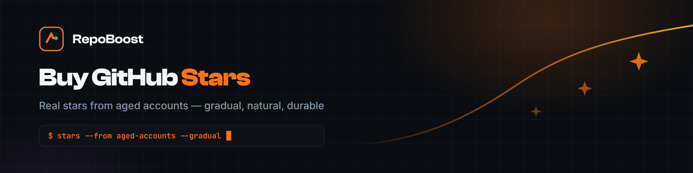

  

  

  
  
  
  
  
  

# Buy GitHub Stars - Real Growth From Aged Accounts

Buy GitHub stars that look like an audience, not a purchase. Every star comes from a real aged account with years of public commit history, delivered gradually so the graph grows the way a genuinely discovered project does - never as a single suspicious spike.

In 2023, WIRED documented how GitHub's own fraud research found that spikes from fresh, empty accounts get flagged and removed within a month. Most sellers still work that way. We built the opposite: real accounts, real pacing, real history - the only pattern that survives.

## ✨ What you get with every order

| | |
|---|---|
| 🧩 **Balanced packages** | stars arrive together with forks, followers and watches |
| 🐢 **Gradual pacing** | no sudden spike - your repo grows like a real audience |
| 🧬 **Aged accounts** | years of commit history and completed profiles behind every star |
| 🎯 **Custom numbers** | exact counts or any mix, delivered the same way |
| 🛡️ **No-drop guarantee** | if any star drops, we replace it free |

## 🧠 Why aged accounts, not fake stars

- **Real history** - every account has years of public commits before it stars your repo.
- **Balanced signals** - stars arrive together with forks, watches and followers.
- **Natural pacing** - delivery looks like an audience arriving, not a purchase.
- **Honest limits** - we tell you what lasts and what gets caught elsewhere.

The usual way is accounts created weeks ago, one burst in the same hour, stars only, no support. The RepoBoost way is real accounts with years of commit history, a gradual 12-24 hour window, and every signal growing together.

## 📦 Packages

| Package | Actions | Balanced mix |
|---|---|---|
| Starter | 1,000 actions | 700 stars + 75 forks + 200 followers + 25 watches |
| Growth · most popular | 1,350 actions | 950 stars + 100 forks + 275 followers + 25 watches |
| Pro | 1,700 actions | 1,200 stars + 125 forks + 345 followers + 30 watches |

Scaling a launch? Large orders up to **40,000 stars** with the same quality and gradual pacing. Custom numbers and mixes are delivered the same way.

### 🔄 How ordering works

1. **Start on the website** - tell us your repo and what you need at buygithub.com.
2. **We confirm and start delivery** - numbers confirmed before payment; delivery begins immediately.
3. **Watch your repo grow** - stars arrive gradually over 12-24 hours from aged accounts with real activity.

### 🛡️ Guarantees and honest limits

- **No-drop guarantee** - anything that drops within 24 hours of delivery is replaced free.
- **Honest limits** - no provider can promise permanence; GitHub controls its own systems. Gradual delivery from real accounts is the most durable method that exists.
- **Live updates** - order confirmation and delivery progress on Telegram.

### 📊 How stars affect visibility

Stars influence GitHub search ranking, trending eligibility and how visitors read a repository. The mechanics are documented in detail: see [how the GitHub Trending algorithm works](https://buygithub.com/blog/how-github-stars-work/?utm_source=github&utm_medium=readme&utm_campaign=buy-github-stars) for star velocity research, and [GitHub Search Ranking](https://buygithub.com/github-search-ranking/?utm_source=github&utm_medium=readme&utm_campaign=buy-github-stars) for placing a repository in the top 1-5 results for chosen keywords.

### 🧰 Related services

- [The full GitHub bundle](https://buygithub.com/buy-github-bundle/?utm_source=github&utm_medium=readme&utm_campaign=buy-github-stars) - every signal in one balanced order
- [Buy GitHub Followers](https://buygithub.com/buy-github-followers/?utm_source=github&utm_medium=readme&utm_campaign=buy-github-stars) - profile credibility from aged accounts
- [How star delivery works](https://buygithub.com/product/stars/?utm_source=github&utm_medium=readme&utm_campaign=buy-github-stars) - the delivery page

  

## ❓ FAQ

**How fast is delivery?**

Packages are delivered within 12-24 hours, paced gradually. Larger volumes up to 40,000 stars are quoted on the website.

**Where do the stars come from?**

From aged accounts with years of public commit history and completed profiles - not fresh registrations.

**Is buying GitHub stars safe?**

Yes, 100% safe. Stars come from real aged accounts with genuine history and arrive through our humanized delivery system with randomized pacing and custom rate curves. The growth pattern is indistinguishable from organic discovery. Full guarantee: if anything drops, we replace it free.

**Can I order exact numbers?**

Yes - custom orders for exact counts or any mix, delivered the same way.

**Will the stars stay?**

Yes, they stay. We offer a no-drop guarantee. Our humanized delivery technology uses custom rate curves and behavioral timing that replicates organic developer activity. If any stars drop for any reason, we replace them at no cost.

**Can I combine stars with followers or forks?**

Yes - any combination in one order. See the packages above.

**How many stars should I order?**

A number your repository's age and activity can carry naturally. Balanced packages scale from 1,000 actions upward, and exact custom numbers are available - we will tell you honestly what looks natural for your repo.

**Will my repo still look natural with purchased stars?**

That is the entire point of the method: stars arrive gradually from aged accounts with real history, together with forks, watches and followers - the pattern that reads as discovery rather than promotion.

**How do I order?**

Start on the website - buygithub.com carries the order flow and the delivery updates.

## Related

- [GitHub Search Ranking](https://github.com/repoboost-hq/github-search-ranking) - top 1-5 on any keyword you name
- [github-stars-history](https://github.com/Marcos66236/github-stars-history) - open-source star history tracker

More from the org: [github.com/repoboost-hq](https://github.com/repoboost-hq)

## Further reading

- [How the GitHub Trending Algorithm Actually Works](https://buygithub.com/blog/how-github-stars-work/?utm_source=github&utm_medium=readme&utm_campaign=buy-github-stars)

---

  <b><a href="https://buygithub.com/buy-github-stars/?utm_source=github&utm_medium=readme&utm_campaign=buy-github-stars">🌐 buygithub.com</a></b> &nbsp;|&nbsp;
  <a href="https://github.com/repoboost-hq">🧰 More from the org</a>

Independent service. Not affiliated with GitHub, Inc.

